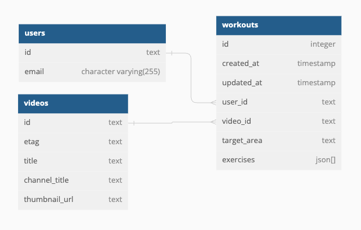

# YouMove - A Fitness App

[YouMove Website](https://server-mxft.onrender.com/)

YouMove app is a fitness app that allows users to create customized workouts that are associated with a specific workout video from YouTube. The purpose of the app is for users to be able to have all their favorite workout videos in one place and to easily take notes on their favorite workout videos!

Test User: 
- Email: test@gmail.com
- Password: Test1234

## User story 
- User can see their saved workouts upon login 
- User can make a search for workout videos 
- User can select a video and create a workout for it 
- User can add the target area and corresponding exercises for a workout
- User can edit, duplicate or delete exercises

## Future Development 
- Drag and drop exercises 
- User can share workouts with others 
- User can check off exercises as they go with the option to restart the workout
- User can start a timer, if an exercise is dependent on time

## Demo 
[Video soon to come]


## Tech Stack

**Client:** React, TailwindCSS

**Server:** Node, Express, 

**Database:** PostgreSQL

**Design:** Figma, dbdiagram.io

## API Reference

[YouTube API](https://developers.google.com/youtube/v3)

[Auth0 API](https://auth0.com/docs/api)

## Wireframe 


## Database Tables



## Installation

This project requires **Auth0**! Please visit Auth0 to make an account and retrieve a domain and clientid. See .envexample for set up!

Step 1: Clone my project & switch into the project directory 

  ```
  git clone git@github.com:yazmintorres/YouMoveApp.git
  cd youmoveapp
```

Step 2: Install all packages.

  ```
  cd client && npm install && cd ../server && npm install
```

Step 3: Setup Environment Variables

Copy the instructions from both .envexample files in the client and server.

Step 4: Connect the database and the data.

  ```
   cd server
   psql postgres -f db.sql
```

Step 5: Start the program!

  ```
   npm run dev
```

Note: Client server will be running on http://localhost:5173 and server will be running on http://localhost:8080.

## Acknowledgement

I'm extremely grateful to my mentor, Vivian Yu, the Techtonica team and my cohort for their support on this project.

